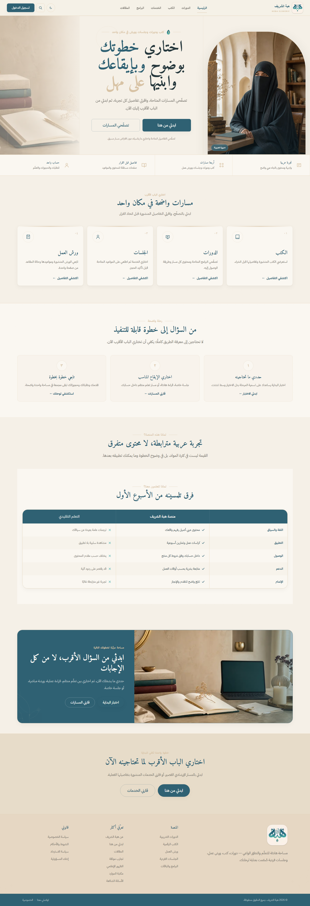
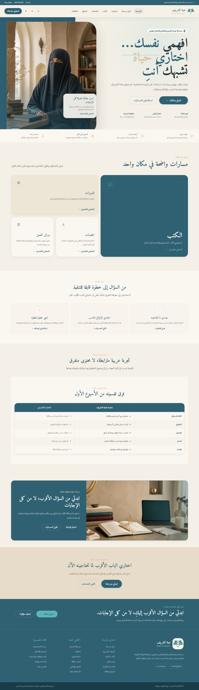
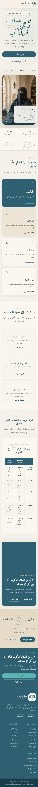
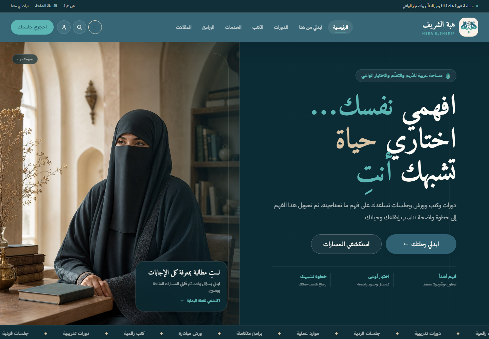
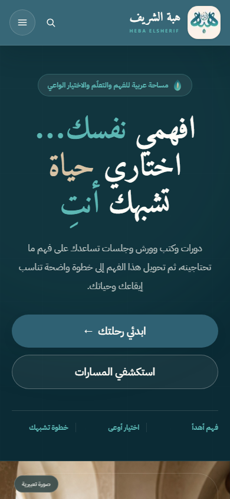

# VISUAL CUSTOMER EXPERIENCE DELIVERY SPRINT

## Snapshot قبل بدء العمل المرئي

- الفرع: `codex/master-merge-2026-08-27`
- HEAD عند أخذ الـSnapshot: `eec5037a20135b51e02c673e768fedbadab7450a`
- remote tracking: `origin/codex/master-merge-2026-08-27`
- الحالة: لا توجد تغييرات tracked غير مثبتة عند البداية. العناصر غير المتتبعة المحفوظة كانت `.agents/` و`docs/CODE_X_DEVELOPMENT_FIRST_FULL_PLAN_AR_2026-08-27.md` و`docs/DECISIONS (1).md` و`docs/PROJECT_STATE (1).md` و`skills-lock.json`.
- ملفا المالكة ذوا اللاحقة `(1)` لم يُعدلا. بصمتهما وقت الـSnapshot:
  - `DECISIONS (1).md`: `6E5C9F049A8C6551E9FC191CC7E3EB212B30CC1F6A1103824A0617FAF5F9597C`
  - `PROJECT_STATE (1).md`: `5CE5CA1D1873869872BAA9037BD03BCCF024254E24C5C30D9111BE8281BDBEBC`
- لم يُشغّل `check:deploy` لإعداد هذا التقرير.

## Commits منذ `d19e511`

| Commit | الميزة | الصفحات المتأثرة مباشرة |
| --- | --- | --- |
| `c5212a9` | حماية نقل سر recovery drill | — |
| `c003c95` | عزل بوابة Staging recovery | — |
| `9972553` | Contact intake محكوم | `/contact`، `/admin/inbox` |
| `1c5677c` | Testimonials موثقة | `/testimonials`، `/admin/reviews` |
| `522552c` | Press publishing محكوم | `/press`، `/admin/press` |
| `a656023` | Resource hub | `/resources`، `/resources/[slug]`، `/search`، `/admin/resources` |
| `f22c796` | Guided assessment versioning | `/start-here`، `/admin/assessments`، `/admin/settings` |
| `e46df42` | Program discovery | `/programs`، `/programs/[slug]`، `/search`، `/services`، `/admin/products` |
| `b011f1c` | Media lifecycle | `/admin/media` |
| `0cfb2e6` | Newsletter consent | `/`، `/admin/inbox`، `/preview/[type]/[id]`، `/unsubscribe/[token]` |
| `95a4b26` | Admin security evidence | `/admin/security` |
| `3c00eff` | Admin reads fail-closed | `/admin/system` |
| `2678347` | Resend outbox | `/admin/inbox`، `/admin/settings` |
| `5eaf74b` | Customer 360 | `/admin/users`، `/admin/users/[id]` |
| `6460c58` | Privacy-safe Sentry | — |
| `27039a5` | Admin notifications | `/admin/users`، `/admin/users/[id]` |
| `12909a0` | Atomic role governance | `/admin/roles` |
| `829d355` | Booking operations | `/admin/bookings` |
| `31f5eb7` | Manual payments/refunds | `/admin/orders`، `/admin/overview`، `/admin/payments`، `/dashboard/orders`، `/dashboard/payments` |
| `e7c4208` | Checkout proof upload | Checkout |
| `0f9a87a` | Customer learning state | Dashboard learning |
| `7547ffa` | Customer protected delivery | Customer delivery |
| `e7c39a5` | Truthful Dashboard reads | `/dashboard` |
| `2984af7` | Customer account actions | Dashboard account |
| `c0caca0` | Password lifecycle | Login/Register/Reset/Update password |
| `e977356` | Booking self-service | Dashboard bookings |
| `c50c351` | Registration bootstrap | `/auth/register` |
| `0e2f864` | Account deletion request | `/dashboard/settings`، `/admin/users` |
| `df86e55` | Protected upload binding | Upload flows |
| `9a9f804` | Course curriculum operations | `/admin/courses/[id]/curriculum` |
| `9de7aa8` | Protected delivery removal | Admin books/courses/workshops |
| `d79434d` | CMS page sections | Home/CMS actions |
| `156bed5` | Navigation operations | Header/Footer Admin |
| `b040072` | CMS page lifecycle | `/admin/pages` |
| `6f518e7` | Article lifecycle | `/admin/articles` |
| `a10449e` | Settings/flags governance | Admin settings |
| `eec5037` | Public-preview evidence | Docs فقط |

## الصفحات الجديدة الفعلية

### عامة

`/press`، `/programs`، `/programs/[slug]`، `/resources`، `/resources/[slug]`، `/testimonials`، `/auth/update-password`.

### Admin

`/admin/assessments`، `/admin/press`، `/admin/resources`.

## migrations المحلية

- العدد عند `d19e511`: 48 ملفًا.
- العدد عند بداية Sprint: 80 ملفًا.
- الجديدة: **32** migration بالترتيب المتصل `048 → 079`.
- لم تُطبق في هذه المرحلة على أي مزود.
- قبل تطبيقها على Staging لن تعمل الاستمرارية الجديدة للتواصل والشهادات والإعلام والموارد والتقييم والبرامج والوسائط والنشرة والبريد والعملاء والإشعارات والأدوار والحجز والدفع والتعلم والحساب والتسليم وCMS والإعدادات. الواجهات غير المتصلة تعرض حالات فارغة صادقة فقط.

## المرحلة المرئية الأولى — Header/Home/Footer

### رابط Preview

`http://127.0.0.1:3102`

المعاينة معزولة: متغيرات Supabase العامة والخاصة محجوبة، ولا تستخدم Production data. المحتوى الظاهر هو fallback/default معلّم في المصدر وليس بيانات عميلات أو شهادات مختلقة.

### ما تغير بصريًا

- Header جديد بطبقة تعريفية، تنقل عربي أوضح، Search، Account، Booking CTA، وحالة active أكثر وضوحًا.
- Mobile navigation جديدة عند 390px مع قائمة لمسية وروابط دخول وحجز صريحة.
- Hero جديد بوعد «افهمي نفسك… اختاري حياة تشبهك»، مع الحفاظ على الصورة التعبيرية للمرأة المنقبة ووصفها بأنها تعبيرية.
- مسارات البداية أعيد ترتيبها بصريًا إلى Composition تحريرية متفاوتة الأحجام بدل شبكة كروت متكررة.
- Footer جديد داكن، بدعوة واضحة للبداية، ثلاثة أعمدة تشغيلية، Search/Account، ونص مسؤول غير علاجي.
- Dark mode محفوظ، والهوية والألوان والخطوط المحلية محفوظة.

### Before / After

#### Desktop قبل

#### Desktop بعد

#### Mobile 390px بعد

لقطات Above-the-fold مستقلة متاحة أيضًا في `docs/evidence/visual-customer-experience/phase-1/after-desktop-1440-fold.png` و`after-mobile-390-fold.png`.

### Admin الذي يتحكم في الأثر

| الأثر العام | Admin |
| --- | --- |
| نص Hero وأزراره | `/admin/pages` داخل صفحة `home`، وكذلك `/admin/settings` |
| ترتيب وظهور أقسام Home | `/admin/pages` → بنية الصفحة الرئيسية |
| روابط Header/Footer وترتيبها | `/admin/pages` → القوائم والرأس والتذييل |

تغييرات المحتوى تحتاج migrations المصدرية `075–077` مطبقة على Staging لإثبات persistence وAdmin-to-public parity. البنية البصرية نفسها لا تحتاج migration جديدة.

### الاختبارات المستهدفة

- `pnpm type-check`: ناجح.
- ESLint للملفات الستة المعدلة: ناجح.
- `pnpm build:isolated`: ناجح، 69/69 صفحة.
- لم يُشغّل `check:deploy` ولم تُعد مجموعة 70/70.
- Browser smoke مستهدف: `200` على 1440 و390، ولا horizontal overflow.
- النقر الفعلي نجح لـHero Start، Hero Services، Header Booking، Header Search، Header Account، Footer Contact، وMobile Menu Booking.
- فتح/إغلاق قائمة الهاتف ناجح؛ Dark mode ناجح.

### المتبقي من المرحلة الكبيرة

- توحيد Loading/Error/Empty/404 بصريًا ضمن Shared public states.
- استكمال بقية Home content sections (Articles/Resources/Verified Testimonials/Verified Press/Newsletter) عند وجود مصدر موثوق أو Preview fixtures معلّمة بوضوح.
- المرحلة التالية المرئية هي صفحات رحلة العميلة العامة؛ لا يبدأ Backend audit جديد بينها.

## تصحيح المراجعة البصرية — Hero سينمائي وحركة واضحة

بعد مراجعة المالكة، عولجت مشكلتا تزاحم الكتابة وغياب الحركة داخل **نفس الشريحة** دون فتح Backend أو migration:

- Header تحوّل إلى نظام داكن عالي التباين بلمسات Aqua/Gold، مع الحفاظ على Search/Account/Booking والتنقل العربي.
- Hero أصبح تكوينًا سينمائيًا ثنائي المساحة: صورة المرأة المنقبة مهيمنة بصريًا، والنص العربي مضبوط على `line-height: 1.12` بثلاثة أسطر مستقلة.
- أضيفت حركة دخول متدرج للنص، Ken Burns للصورة، glow بطيء، بطاقة عائمة، شريط مسارات مستمر، وDrawer متحرك للهاتف.
- `prefers-reduced-motion` يلغي الحركات ويُبقي المحتوى ظاهرًا بالكامل.
- لم تُنسخ صورة أو كتابة أو تخطيط من الموقع المرجعي؛ استُخدمت مبادئ القوة البصرية فقط: scale، contrast، cinematic image وmotion hierarchy.

### دليل التصحيح

دليل الحركة: `docs/evidence/visual-customer-experience/phase-1/hero-motion-desktop.webm`.

### تحقق مستهدف

- Desktop و390px: `status=200` و`overflow=0` و`linesOverlap=false`.
- أسماء الحركات المحسوبة حيًا: `hero-enter` و`hero-portrait-in` و`hero-marquee` و`slide-in-end`.
- Reduced motion: `animation=none` والمحتوى `opacity=1`.
- Hero Start وHero Services وHeader Booking: نقر فعلي 3/3 ناجح.
- TypeScript وfocused ESLint والبناء المعزول 69/69 ناجحة؛ لم تُشغّل مجموعة 70/70 أو `check:deploy`.
